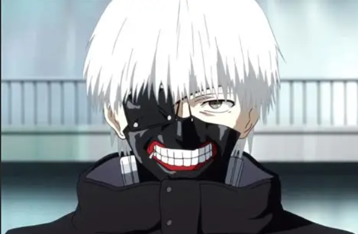

# desafio-github-markdown
### Sei la, vou falar do meu primeiro anime

---

Muito legal pena que não se fala tantooo dele, mas pelo menos tem uma música inspirada.

---

Por sinal essas flores na capa se chamam Lírio da aranha vermelha, e melhor ainda, as flores no anime tem todo um significado. 

Para saber mais você pode entrar nesse [link](https://aminoapps.com/c/tokyoghoulbrasil/page/blog/voce-sabia-flores-de-tokyo-ghoul/QKmx_o0jIXuloPR4YvLjM6eBzwNVqZX1WRx).

---
## Personagens Favoritos

Gosto muito do [Juuzou Suzuya](https://tokyoghoul.fandom.com/wiki/Juuzou_Suzuya), principalmente nessa coloração do cabelo dele. Nas primeiras temporadas (1° e 2°) quando tinha cabelo branco, ele se assemelhava muito a uma garota, acho que a voz também ajudava a pensar isso. Ele é um Investigador Ghoul de Classe Especial. No passado, ele atendia pelo nome de Rei Suzuya. Atualmente tem entre 29/30 anos (após: re cap. 179)

---

Obviamente também gosto muito do personagem principal [Ken Kaneki](https://tokyoghoul.fandom.com/wiki/Ken_Kaneki), ele é atualmente o marido de Touka Kirishima(amo esse casal!!!) e pai de Ichika Kaneki e também tem um filho que ainda não nasceu(manga já acabou). Meio humano meio Ghoul, foi atacado pela Rize mas ela também se deu mal e acabaram transferindo os orgãos dela pra ele, e então começa a história dele e do mundo Ghoul. Tem 23 anos (depois de: re Cap. 32). O manga acabou no Cap. 179.
É uma obra magnífica, tenho muito orgulho de ter sido meu primeiro, além de ser um dos meus favoritos junto de _Black Clover_.