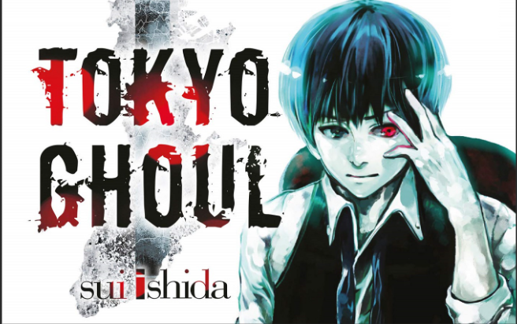
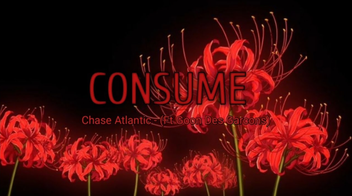
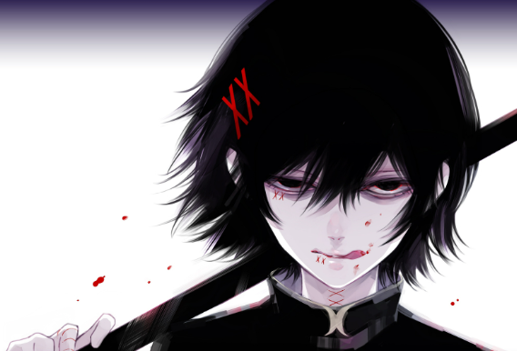

# desafio-github-markdown
### Sei la, vou falar do meu primeiro anime

---

Muito legal pena que não se fala tantooo dele, mas pelo menos tem uma música inspirada.

---

Por sinal essas flores na capa se chamam Lírio da aranha vermelha, e melhor ainda, as flores no anime tem todo um significado. 

Para saber mais você pode entrar nesse [link](https://aminoapps.com/c/tokyoghoulbrasil/page/blog/voce-sabia-flores-de-tokyo-ghoul/QKmx_o0jIXuloPR4YvLjM6eBzwNVqZX1WRx).

---
## Personagens Favoritos

Gosto muito do Juuzou Suzuya, principalmente nessa coloração do cabelo dele. Nas primeiras temporadas (1° e 2°) quando tinha cabelo branco, ele se assemelhava muito a uma garota, acho que a voz também ajudava a pensar isso. Ele é um Investigador Ghoul de Classe Especial. No passado, ele atendia pelo nome de Rei Suzuya. Atualmente tem entre 29/30 anos (após: re cap. 179)